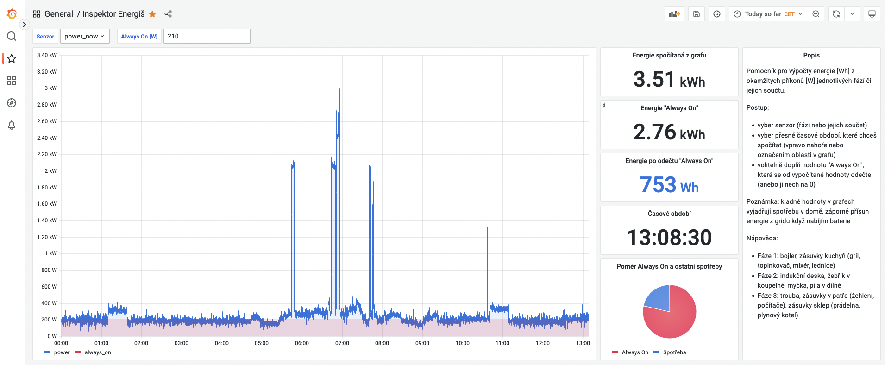

Pomocník pro výpočty energie [Wh] z okamžitých příkonů [W] jednotlivých fází či jejich součtu.

Poznámka: v souboru `models.json` je anonymizované ID postgresql databáze (`datasource.uid` pro `type=postgres`)
a ID nástěnky (`uid`). Pokud budeš model importovat, nahraď hodnoty `xxx` a `yyy`
za nějaký 9-ti místný hash (a-zA-Z0-9).
