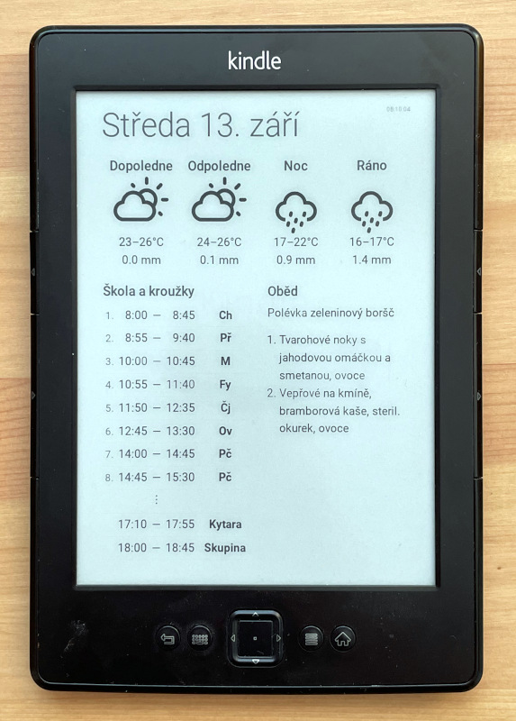

Webová aplikace, která generuje stránku s informace pro čtečku Kindle.
Více informací na [blogpostu](http://tkalci.cz/2023/zapisy/kindle-ctvrty.html).



Build Docker image:

```bash
docker build . -t msgre/kindle-kalendar
````

Spuštění webové aplikace:

```bash
docker run --rm -ti -p 8085:8085 -v $PWD:/app msgre/kindle-kalendar
```

Nyní spusťte prohlížeč a zadejte adresu `http://localhost:8085`
